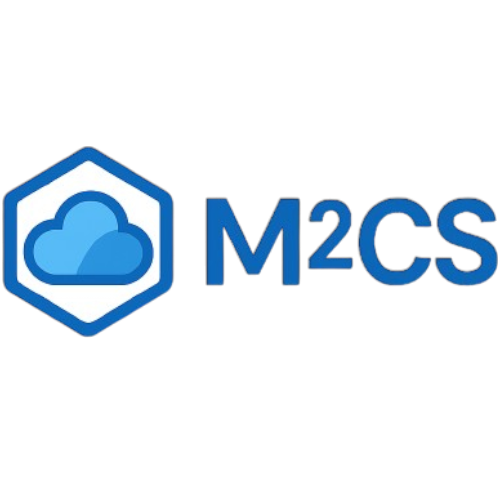

<a id="readme-top"></a>

<!-- PROJECT SHIELDS -->

[![Contributors][contributors-shield]][contributors-url]
[![Forks][forks-shield]][forks-url]
[![Stargazers][stars-shield]][stars-url]
[![Issues][issues-shield]][issues-url]
[![project_license][license-shield]][license-url]

<br />
<div align="center">
  <a href="https://github.com/tizianocitro/m2cs">
    
  </a>

  <p align="center">
    <b>Multi-Cloud Multi-Storage</b>
    <br />
    <br />
    A Go library for multi/hybrid-cloud storage with transparent replication functionality    <br />
    <br />
    <a href="docs/api.md"><strong>Explore the docs »</strong></a>
    <br />
    <br />
    <a href="examples/fileClient_full_demo.go">View Demo</a>
    ·
    <a href="https://github.com/tizianocitro/m2cs/issues">Report Bug</a>
    ·
    <a href="https://github.com/tizianocitro/m2cs/issues">Request Feature</a>
  </p>
</div>

<details>
  <summary>Table of Contents</summary>
  <ol>
    <li>
      <a href="#about-the-project">About The Project</a>
      <ul>
        <li><a href="#overview">Overview</a></li>
        <li><a href="#supported-providers">Supported Providers</a></li>
        <li><a href="#built-with">Built With</a></li>
      </ul>
    </li>
    <li>
      <a href="#-getting-started">Getting Started</a>
      <ul>
        <li><a href="#prerequisites">Prerequisites</a></li>
        <li><a href="#installation">Installation</a></li>
      </ul>
    </li>
    <li><a href="#-usage">Usage</a></li>
    <li><a href="#-roadmap">Roadmap</a></li>
    <li><a href="#-license">License</a></li>
    <li><a href="#-contact">Contact</a></li>
  </ol>
</details>

---

## About The Project

M²CS is a Go library designed to abstract and unify interactions with heterogeneous cloud storage providers. It simplifies the development of multi-cloud and hybrid-cloud applications by providing a consistent interface for object storage, transparent data replication, intelligent load balancing, caching, and secure file transformations such as encryption and compression."

### Overview

In modern cloud-native architectures, relying on a single storage provider creates **vendor lock-in** risks and limits infrastructure flexibility. Developing multi-cloud solutions, however, often leads to code fragmentation due to incompatible SDKs and APIs.

**M²CS** solves this by acting as an intermediate abstraction layer. It allows developers to write code once and deploy it across multiple providers (AWS S3, Azure Blob, MinIO) without managing specific SDK implementations.

### Supported Providers

[](https://aws.amazon.com/s3/)
[](https://azure.microsoft.com/en-us/services/storage/blobs/)
[](https://min.io/)

### Built With

**Core Technologies**

[](https://go.dev/) 
[](https://www.docker.com/) 
[](https://golang.testcontainers.org/)

<p align="right">(<a href="#readme-top">back to top</a>)</p>

---

## 🚀 Getting Started

### Prerequisites

* Go 1.18 or higher

### Installation

Install the library into your module:

```bash
go get github.com/tizianocitro/m2cs
```

<p align="right">(<a href="#readme-top">back to top</a>)</p>

---

## 🎮 Usage

Here is a quick example of how to initialize the orchestrator and upload a file with **Async Replication** and **Encryption**.

```go
package main

import (
    "context"
    "log"
    "bytes"
    "[github.com/tizianocitro/m2cs](https://github.com/tizianocitro/m2cs)"
)

func main() {
    // 1. Configure Connections
	
    // AWS S3
    s3Config := m2cs.NewS3Connection("us-east-1", m2cs.ConnectionOptions{
        ConnectionMethod: m2cs.ConnectWithEnvCredentials(),
        IsMainInstance:   true,
        SaveCompress:     m2cs.GZIP_COMPRESSION,
    })

    // Azure Blob
    azConfig := m2cs.NewAzBlobConnection("my-container", m2cs.ConnectionOptions{
        ConnectionMethod: m2cs.ConnectWithConnectionString("YOUR_AZURE_CONNECTION_STRING"),
        IsMainInstance:   true,
        SaveEncrypt:      m2cs.AES256_ENCRYPTION,
        EncryptKey:       "super-secret-key-32bytes-long!!",
    })

    // 2. Initialize the Orchestrator (FileClient)
    // Strategy: Async Replication, Round Robin for load balancing
    fileClient := m2cs.NewFileClient(
        m2cs.ASYNC_REPLICATION,
        m2cs.ROUND_ROBIN,
        s3Config, 
        azConfig,
    )

    // 3. Configure Caching (Optional)
    fileClient.ConfigureCache(m2cs.CacheOptions{
        Enabled: true, 
        TTL: 600,
        MaxSizeMB: 500,
    })

    // 4. Upload File
    data := []byte("Hello Multi-Cloud!")
    err := fileClient.PutObject(context.TODO(), "my-bucket", "hello.txt", bytes.NewReader(data))
    
    if err != nil {
        log.Fatalf("Upload failed: %v", err)
    }
    log.Println("File uploaded and replicating asynchronously")
}

```

For a complete working example, check the `examples/` folder.

<p align="right">(<a href="#readme-top">back to top</a>)</p>

---

## 🛤 Roadmap

- [ ] **Extended Transformation Algorithms**: Expansion of supported compression and encryption algorithms to offer greater flexibility.
- [ ] **Observability & Metrics**: Implementation of a monitoring system to track latency, error rates, and throughput across different providers.
- [ ] **Quorum-Based Consensus**: Introduction of Quorum mechanisms for read/write operations to guarantee **strong consistency** and higher reliability in distributed scenarios.
- [ ] **NoSQL Database Support**: Extension of the *Multi-Storage* paradigm beyond object storage to include semi-structured data persistence (e.g., MongoDB, DynamoDB).

See the [open issues][issues-url] for a full list of proposed features.

<p align="right">(<a href="#readme-top">back to top</a>)</p>

---

## 📜 License

Distributed under the MIT License. See `LICENSE` for more information.

<p align="right">(<a href="#readme-top">back to top</a>)</p>

---

## 📧 Contact

**Luca Del Bue** - [LinkedIn Profile][linkedin-url]

**Project Link**: [https://github.com/tizianocitro/m2cs][repo-url]

<p align="right">(<a href="#readme-top">back to top</a>)</p>


<!-- MARKDOWN LINKS & IMAGES -->
[repo-url]: https://github.com/tizianocitro/m2cs
[org-name]: tizianocitro
[repo-name]: m2cs

[contributors-shield]: https://img.shields.io/github/contributors/tizianocitro/m2cs.svg?style=for-the-badge
[contributors-url]: https://github.com/tizianocitro/m2cs/graphs/contributors

[forks-shield]: https://img.shields.io/github/forks/tizianocitro/m2cs.svg?style=for-the-badge
[forks-url]: https://github.com/tizianocitro/m2cs/network/members

[stars-shield]: https://img.shields.io/github/stars/tizianocitro/m2cs.svg?style=for-the-badge
[stars-url]: https://github.com/tizianocitro/m2cs/stargazers

[issues-shield]: https://img.shields.io/github/issues/tizianocitro/m2cs.svg?style=for-the-badge
[issues-url]: https://github.com/tizianocitro/m2cs/issues

[license-shield]: https://img.shields.io/github/license/tizianocitro/m2cs.svg?style=for-the-badge
[license-url]: https://github.com/tizianocitro/m2cs/blob/main/LICENSE

[linkedin-shield]: https://img.shields.io/badge/-LinkedIn-black.svg?style=for-the-badge&logo=linkedin&colorB=555
[linkedin-url]: https://www.linkedin.com/in/ldelbue